# Scientific Context Notes

A Chrome (Manifest V3) research companion: contextual annotations on web pages **and PDFs**,
project-based organisation of sources, citations and bibliographies via real CSL, a rule-driven
citation-style editor, and local-first collaboration.

> **Status:** **all five roadmap phases delivered.** Current release: **v0.25.0**.
> See [`CHANGELOG.md`](CHANGELOG.md) and [`doc/STATUS.md`](doc/STATUS.md).

## What it does

| Area | What you get |
|---|---|
| **Capture** | File the current page into a project — title, authors, year, DOI, journal — deduplicated by DOI. |
| **Annotations** | Anchor notes to a passage using W3C selectors (quote → position → CSS), with a review status per note. |
| **PDFs** | A bundled `pdf.js` reader: text highlights and drag-a-rectangle region anchors, stored as fraction coordinates so they survive zoom and DPR changes. |
| **Dashboard** | Overview + Kanban by workflow status, Documents, References (with DOI import), Annotations, Citation styles, Team. |
| **Citations** | citeproc-js with APA, Harvard, Vancouver, MLA and Chicago (author–date **and** notes) — copy an in-text citation or a bibliography entry anywhere. |
| **Style editor** | A full-screen editor turning plain rules (max authors, et al., DOI/URL inclusion, page labels, FOI and legal templates) into CSL overrides, with a live citeproc preview. Import a journal's own `.csl` file as a base style, or export the compiled one. |
| **Team** | Members & roles with a capability matrix, an activity feed with before→after diffs, and anchored comment threads with reply / resolve. |
| **Sync** | The whole project as one portable JSON snapshot — optionally encrypted with AES-GCM — that merges back on import, deduplicating sources and references **by DOI**. An import shows exactly what it would change before it writes anything. |

**Local-first, no backend.** Everything lives in this browser's IndexedDB. Roles are therefore
**advisory** — every collaborator holds a full copy of the project, so nothing can enforce a role,
and the Team view says so in plain words. Collaboration travels by shared snapshot, not by a server:
**Team → Sync** exports the project as a file (plain JSON for backup and inspection, or encrypted
with a password) and merges one back in. PDF bytes are opt-in, because a snapshot you cannot send is
not a way of sharing work.

## Screens

The project workspace — sources counted by review status, and the workflow board they move across:


The bundled PDF reader. Highlights and dragged regions are stored as fractions of the page box, so
they land in the right place after a zoom, a reload, or a different screen:


The side panel is where capture happens, and the reading list groups sources by status:

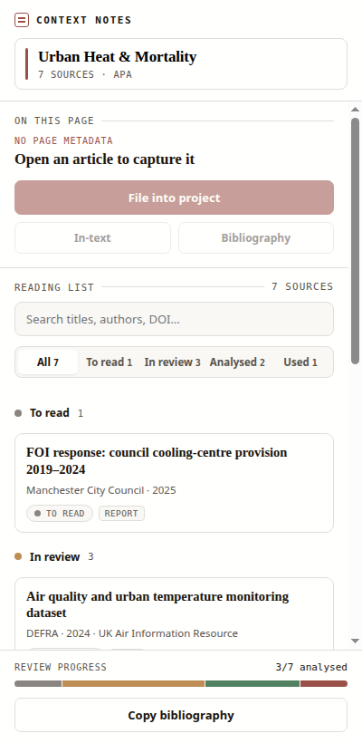

<details>
<summary><b>Eleven more screens</b> — Documents, Annotations, References, the style editor, and every
Team tab</summary>

### Dashboard

**Documents** — one row per source, filtered by status, with the section and note count:

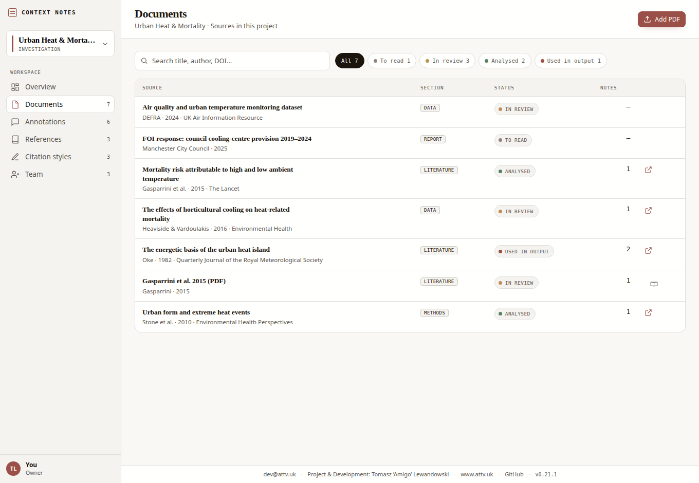

**Annotations** — every note in the project, each anchored to the passage it came from:

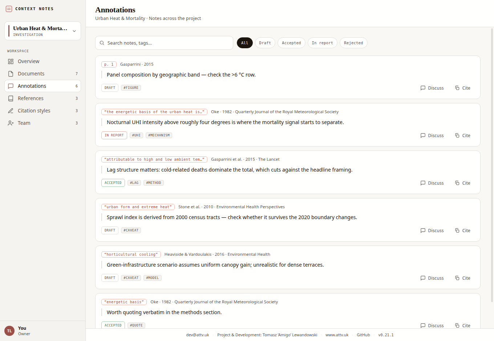

**References** — the bibliographic records behind the citations:

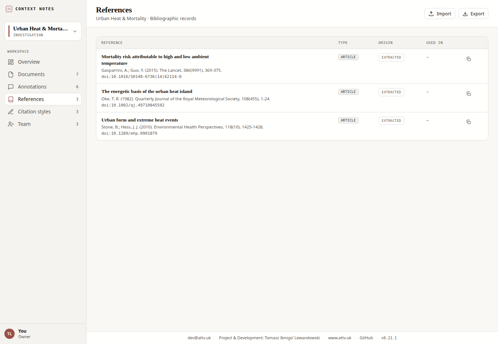

**Citation styles** — the compact view: profiles on the left, rules and a live citeproc preview on
the right:

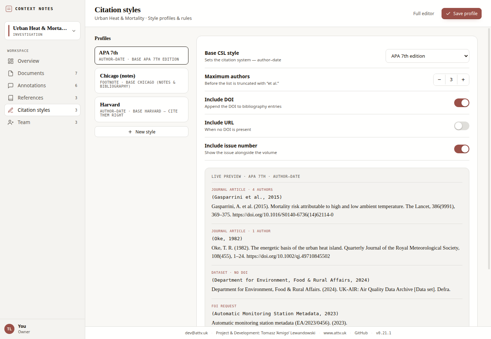

### Style editor

Plain rules on the left, real citeproc output on the right — no CSL XML is edited by hand:

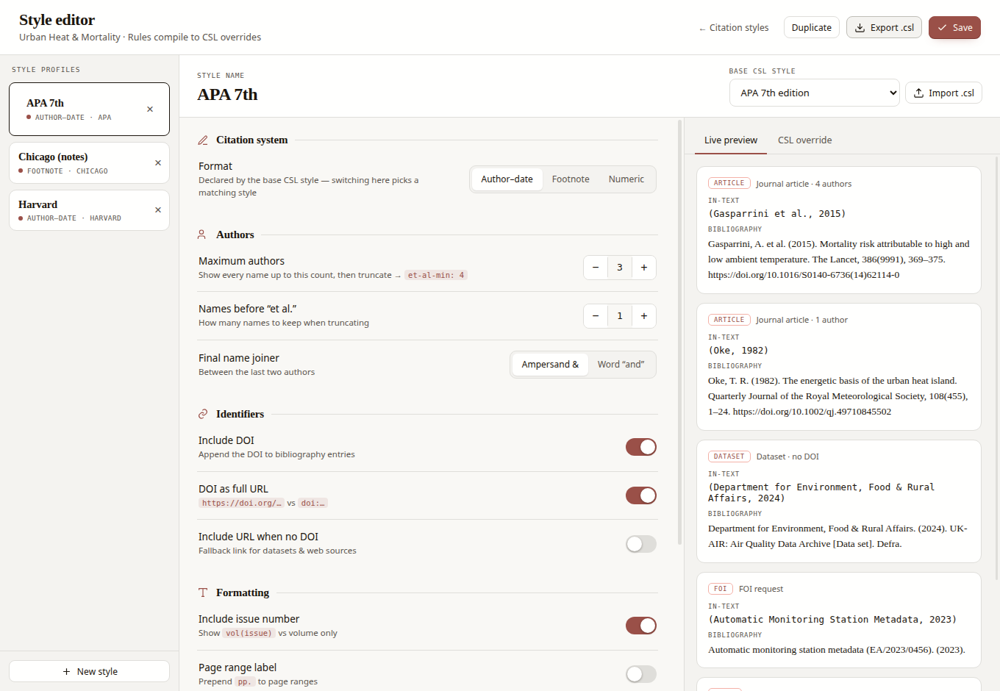

The **CSL override** tab shows what those rules compile to, and `Export .csl` saves the compiled
style:

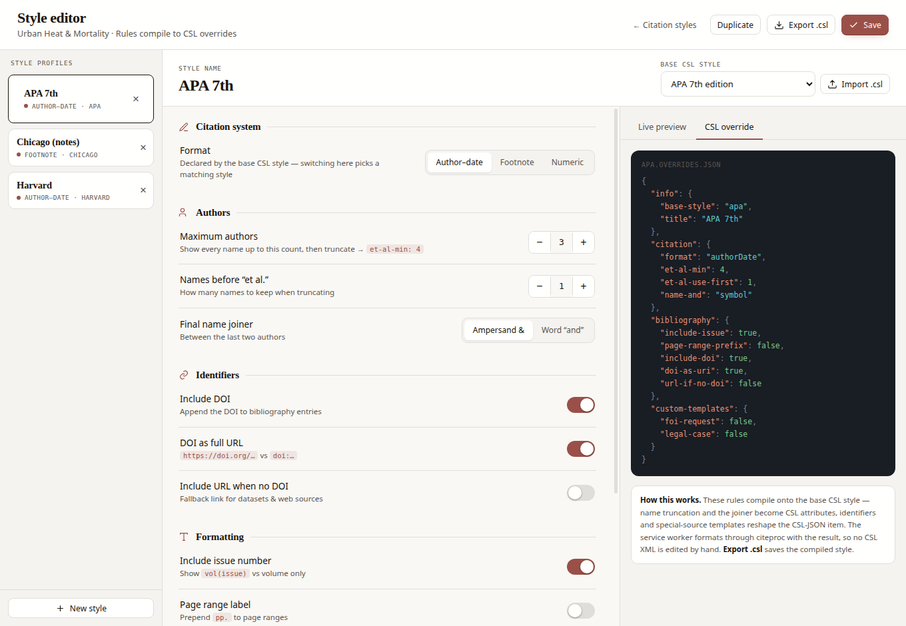

### Team

**Activity** — every change, recorded where it happens, with before→after diffs:

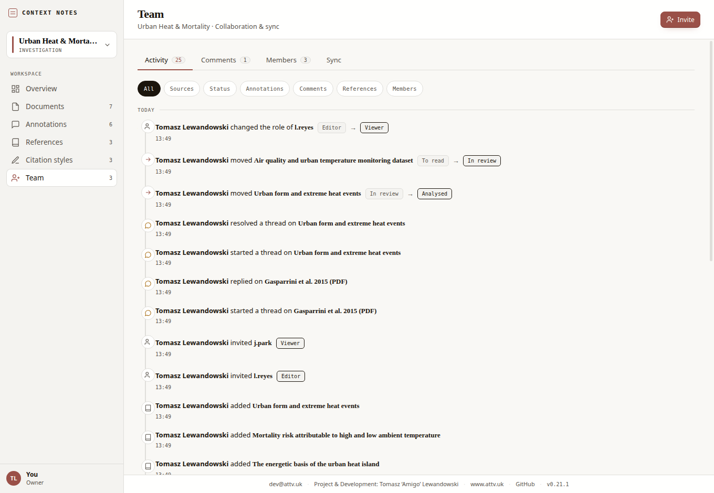

**Comments** — threads anchored to a note or a source, with reply and resolve:

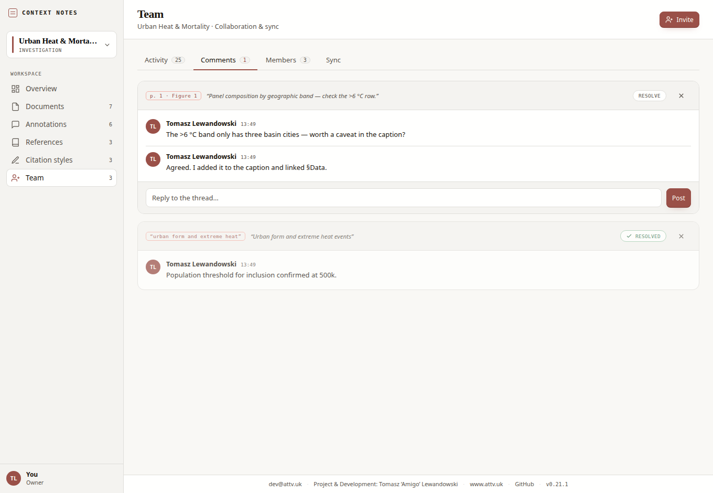

**Members** — roles, the capability matrix, and the plain statement that roles are advisory:

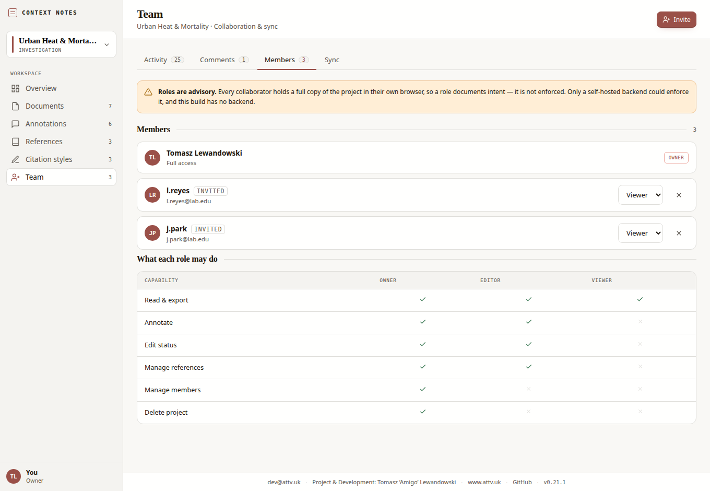

**Sync** — the mode selector, snapshot export with an optional password, and import:

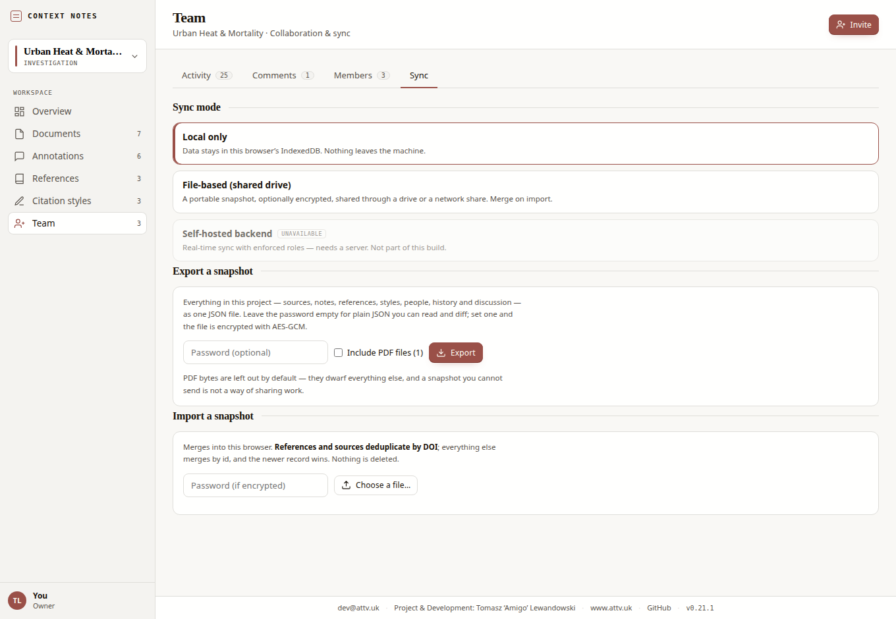

### Side panel

Picking a status directly — including moving a source *back*, which click-cycling could never do:

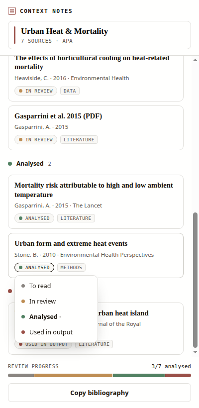

</details>

## Development

```bash
npm install        # install dependencies
npm run dev        # Vite dev server with MV3 HMR (load dist/ as an unpacked extension)
npm run build      # typecheck + production build → dist/
npm test           # unit tests (Vitest)
npm run test:e2e   # end-to-end tests (Playwright, extension loaded in headed Chromium)
npm run lint       # ESLint
npm run typecheck  # tsc --noEmit
```

Load the unpacked extension from `dist/` at `chrome://extensions` (Developer mode).

## Architecture

- **Ports & adapters:** a pure domain core in `src/core` (no `chrome.*`, no storage types) with thin
  adapters in `src/adapters`. Surfaces: `src/background` (service worker), `src/sidepanel`,
  `src/options` (dashboard), `src/pdfviewer`.
- **Storage:** IndexedDB with a versioned schema and append-only migrations (currently **v5**:
  projects, documents, annotations, references, citation styles, users, files, activity, comment
  threads, imported base styles).
- **Snapshots:** `src/core/snapshot/envelope.ts` (WebCrypto AES-GCM + PBKDF2, 600k iterations),
  `src/core/snapshot/validate.ts` (the import boundary — an imported file is somebody else's data)
  and `src/core/usecases/snapshot.ts` (build / merge, hard DOI dedup, newest record wins).
- **Messaging:** one typed contract (`src/core/messages.ts`) shared by every surface, routed by a
  pure `handleRequest`. Domain changes are recorded to the activity feed **there**, so a change made
  in the side panel or the PDF reader shows up without either surface knowing the feed exists.
- **Citations:** citeproc-js + CSL, vendored locally — MV3 forbids remote code. The base styles are
  fetched as extension assets on first use rather than bundled, keeping ~520 kB of XML out of the
  service worker.

See [`doc/architecture.md`](doc/architecture.md), [`doc/data-model.md`](doc/data-model.md) and
[`doc/citations.md`](doc/citations.md).

## Documentation

| File | Contents |
|---|---|
| [`doc/STATUS.md`](doc/STATUS.md) | Where the project stands and what to do next |
| [`doc/roadmap.md`](doc/roadmap.md) | The five development phases |
| [`doc/architecture.md`](doc/architecture.md) | Ports & adapters, testability |
| [`doc/data-model.md`](doc/data-model.md) | Entities and anchoring |
| [`doc/citations.md`](doc/citations.md) | CSL, styles and user rules |
| [`doc/ui-ux.md`](doc/ui-ux.md) | Surfaces and interaction design |
| [`CHANGELOG.md`](CHANGELOG.md) | Every release, Keep a Changelog format |
| [`THIRD-PARTY-NOTICES.md`](THIRD-PARTY-NOTICES.md) | Bundled fonts, CSL styles and their licences |

## Testing

241 unit tests (Vitest, `fake-indexeddb`) and 24 end-to-end tests that load the built extension into
a real Chromium and drive the side panel, dashboard and PDF reader. CI runs typecheck → lint → unit →
build, plus an E2E job under xvfb.

---

dev@attv.uk · Project & Development: Tomasz 'Amigo' Lewandowski · [www.attv.uk](https://www.attv.uk)
