# Scientific Context Notes

A Chrome (Manifest V3) research companion: contextual annotations on web pages **and PDFs**,
project-based organisation of sources, citations and bibliographies via real CSL, a rule-driven
citation-style editor, and local-first collaboration.

> **Status:** **all five roadmap phases delivered.** Current release: **v1.8.0** — the outline
> release, turning highlighted passages into a cited draft. See [`CHANGELOG.md`](CHANGELOG.md) and
> [`doc/STATUS.md`](doc/STATUS.md).

## Quick start

A built-in **guide opens on first install** (and stays behind the panel's **Guide** button), and a
**getting-started checklist** in the side panel checks the steps below off as you actually do them
— each completed action suggests the natural next one.

1. **Install**: from the Chrome Web Store, or unpacked — `npm ci && npm run build`, then
   `chrome://extensions` → Developer mode → _Load unpacked_ → the `dist/` folder.
2. **Open the side panel** with the toolbar icon. A default project ("My Research") is created for
   you; the header switches projects, and its **Dashboard** button opens the full workspace.
3. **File a source**: open the **article page itself** (not a search-results page — the panel will
   tell you if you try) and press **File into project**. If the page carries a DOI, the record is
   auto-completed from the DOI registry: structured authors, year, journal, volume, issue, pages.
4. **Fix anything by hand**: Dashboard → Documents → **Edit** on any row — full bibliographic
   record, plus **Refresh from DOI**.
5. **Annotate**: press **Annotate this page**, approve the one-time per-site prompt, then select
   text and pick one of **four highlight colours** — your own code for what a passage means. Add
   your words in the panel's note card. Highlights repaint, in their colour, on your next visit.
   Revoke a site any time in `chrome://extensions` → Details → _Site access_.
6. **PDFs**: Dashboard → Documents → **Add PDF** opens the bundled reader — text highlights, drawn
   region anchors, notes and review statuses, all surviving zoom and reload.
7. **Outline**: Dashboard → **Outline** — give each highlight a section of your essay (defaults:
   Introduction, Background, Evidence, Counter-arguments, Conclusion, or your own), assigned from
   the side panel's note card while you read or in bulk on this screen. **Copy draft** puts the
   whole essay — section headings, quotes, your notes and citations — on the clipboard for Word or
   Google Docs; **Download .md** saves the same thing as a file.
8. **Cite**: pick a style (APA, Harvard — Cite Them Right **or Solent University**, Chicago ×2,
   MLA, Vancouver — or your own rules in the style editor), then **Cite** on a row for an in-text
   citation or **Copy bibliography** for the whole project.
9. **Share**: Team → Sync → **Export** (optionally password-encrypted). Your collaborator imports
   the file and sees exactly what would change before anything is written.

## What it does

| Area             | What you get                                                                                                                                                                                                                                                                                                                                                                                                                                                                                                              |
| ---------------- | ------------------------------------------------------------------------------------------------------------------------------------------------------------------------------------------------------------------------------------------------------------------------------------------------------------------------------------------------------------------------------------------------------------------------------------------------------------------------------------------------------------------------- |
| **Capture**      | File the current page into a project — title, authors, year, DOI, journal, volume/issue/pages — deduplicated by DOI and auto-completed from the DOI registry. Search-results pages (Google Scholar & friends) refuse to file instead of storing junk.                                                                                                                                                                                                                                                                     |
| **Annotations**  | Anchor notes to a passage using W3C selectors (quote → position → CSS), with a review status per note. On a live web page, select text and pick one of **four highlight colours** — your own taxonomy, independent of review status — painted as overlays that re-anchor after a reload; notes are written in the panel card. Access is opt-in per site.                                                                                                                                                                  |
| **PDFs**         | A bundled `pdf.js` reader: text highlights and drag-a-rectangle region anchors, stored as fraction coordinates so they survive zoom and DPR changes.                                                                                                                                                                                                                                                                                                                                                                      |
| **Dashboard**    | Overview + Kanban by workflow status, Documents, References (with DOI import), Annotations, Outline, Citation styles, Team.                                                                                                                                                                                                                                                                                                                                                                                               |
| **Outline**      | Give each highlighted passage a place in the argument — an editable section of the essay (add, rename, reorder, delete), assigned from the side panel's note card while you read or in bulk on the dashboard's Outline screen. **Copy draft** or **Download .md** turns it into a formatted export: section headings, each quote followed by its citation, and a reference list holding only what was actually cited. Nothing assigned yet? The export falls back to grouping by highlight colour, and says so on screen. |
| **Citations**    | citeproc-js with APA, Harvard (Cite Them Right and Solent University), Vancouver, MLA and Chicago (author–date **and** notes) — copy an in-text citation or a bibliography entry anywhere. Author names are parsed into family/given so in-text citations, inversion and sorting come out right. A copied **draft** is cited as **one document**, not source by source, so a numeric style (Vancouver) numbers correctly and a repeated source disambiguates the same way throughout.                                     |
| **Style editor** | A full-screen editor turning plain rules (max authors, et al., DOI/URL inclusion, page labels, FOI and legal templates) into CSL overrides, with a live citeproc preview. Import a journal's own `.csl` file as a base style, or export the compiled one.                                                                                                                                                                                                                                                                 |
| **Team**         | Members & roles with a capability matrix, an activity feed with before→after diffs, and anchored comment threads with reply / resolve.                                                                                                                                                                                                                                                                                                                                                                                    |
| **Sync**         | The whole project as one portable JSON snapshot — optionally encrypted with AES-GCM — that merges back on import, deduplicating sources and references **by DOI**. An import shows exactly what it would change before it writes anything.                                                                                                                                                                                                                                                                                |

**Local-first, no backend.** Everything lives in this browser's IndexedDB. Roles are therefore
**advisory** — every collaborator holds a full copy of the project, so nothing can enforce a role,
and the Team view says so in plain words. Collaboration travels by shared snapshot, not by a server:
**Team → Sync** exports the project as a file (plain JSON for backup and inspection, or encrypted
with a password) and merges one back in. PDF bytes are opt-in, because a snapshot you cannot send is
not a way of sharing work.

## Screens

The project workspace — sources counted by review status, and the workflow board they move across:


The bundled PDF reader. Highlights and dragged regions are stored as fractions of the page box, so
they land in the right place after a zoom, a reload, or a different screen:


The side panel is where capture happens, and the reading list groups sources by status:

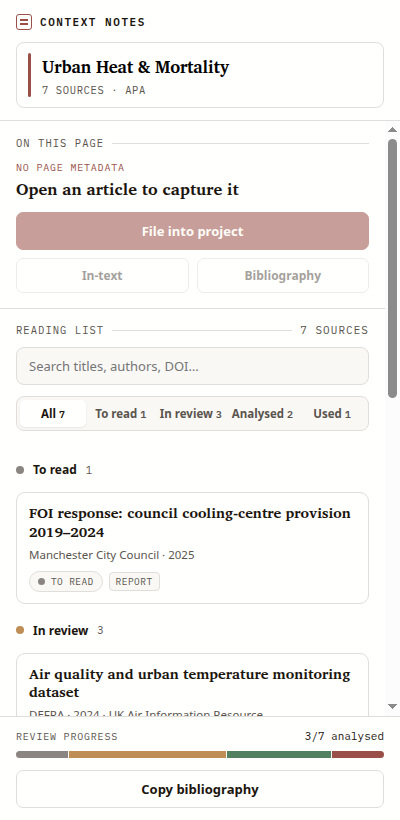

<details>
<summary><b>Eleven more screens</b> — Documents, Annotations, References, the style editor, and every
Team tab</summary>

### Dashboard

**Documents** — one row per source, filtered by status, with the section and note count:

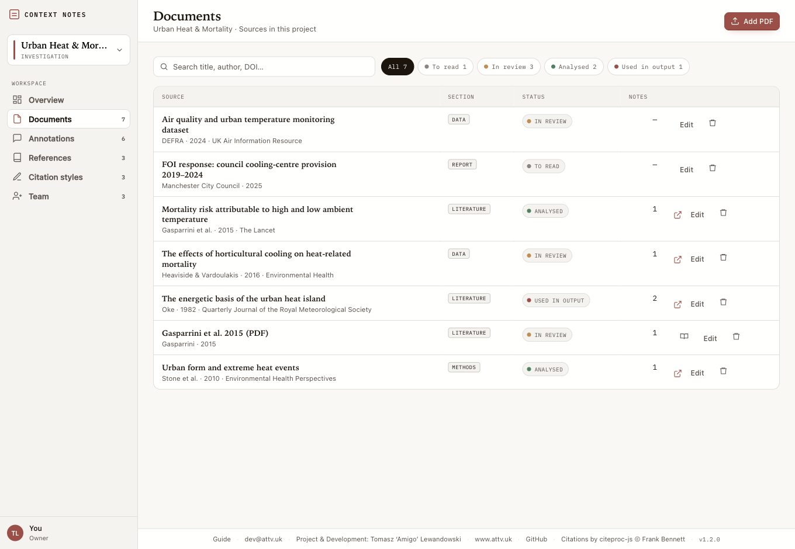

**Annotations** — every note in the project, each anchored to the passage it came from:

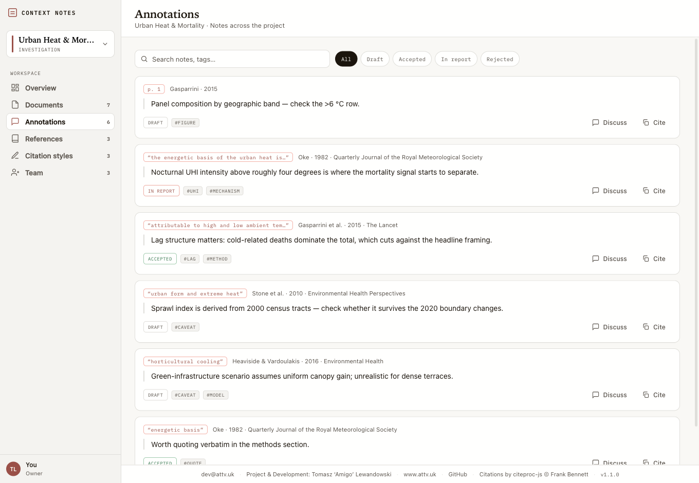

**References** — the bibliographic records behind the citations:

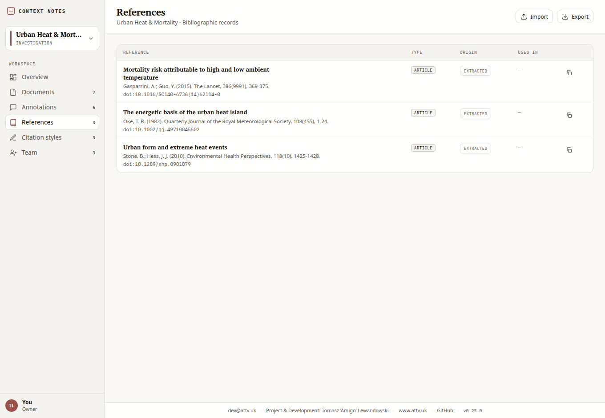

**Citation styles** — the compact view: profiles on the left, rules and a live citeproc preview on
the right:

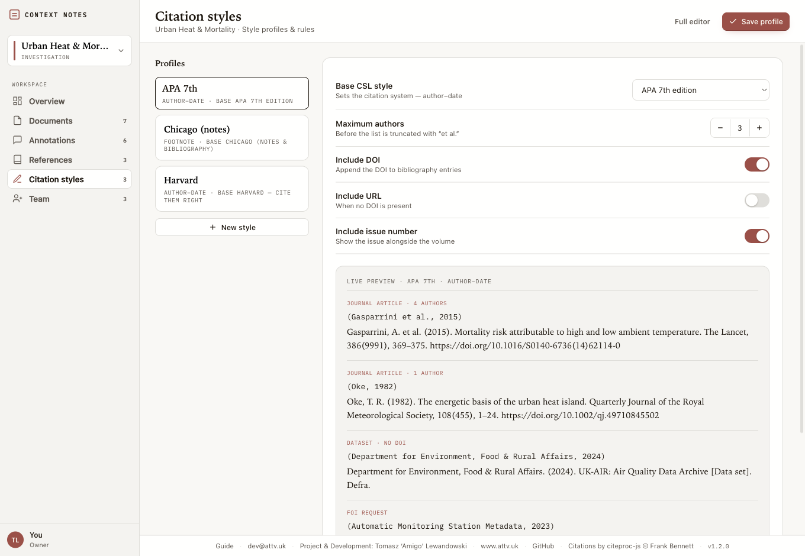

### Style editor

Plain rules on the left, real citeproc output on the right — no CSL XML is edited by hand:

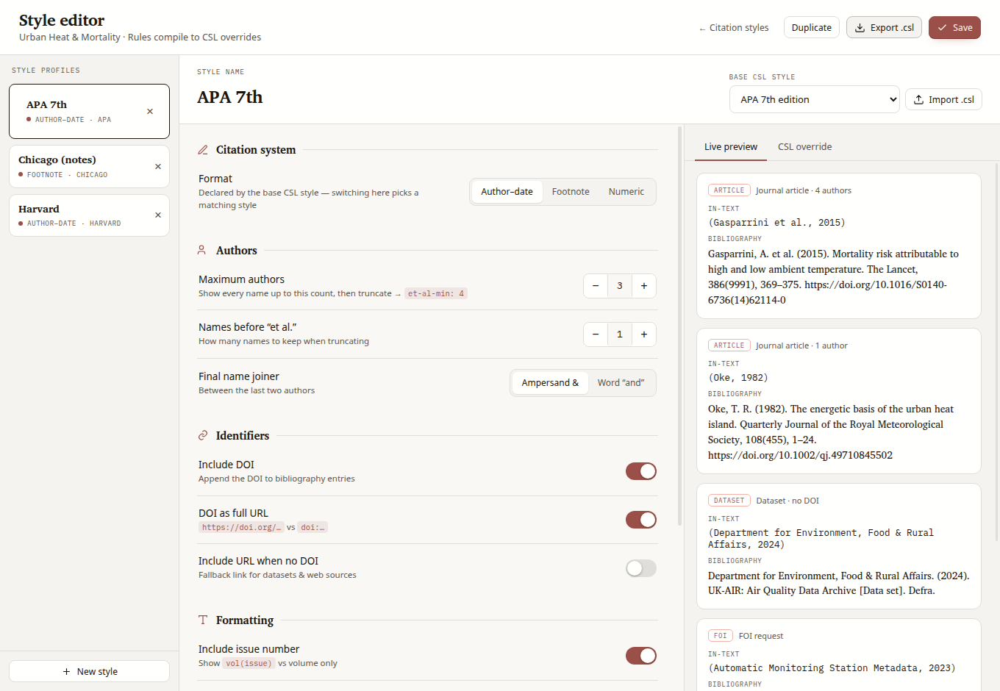

The **CSL override** tab shows what those rules compile to, and `Export .csl` saves the compiled
style:

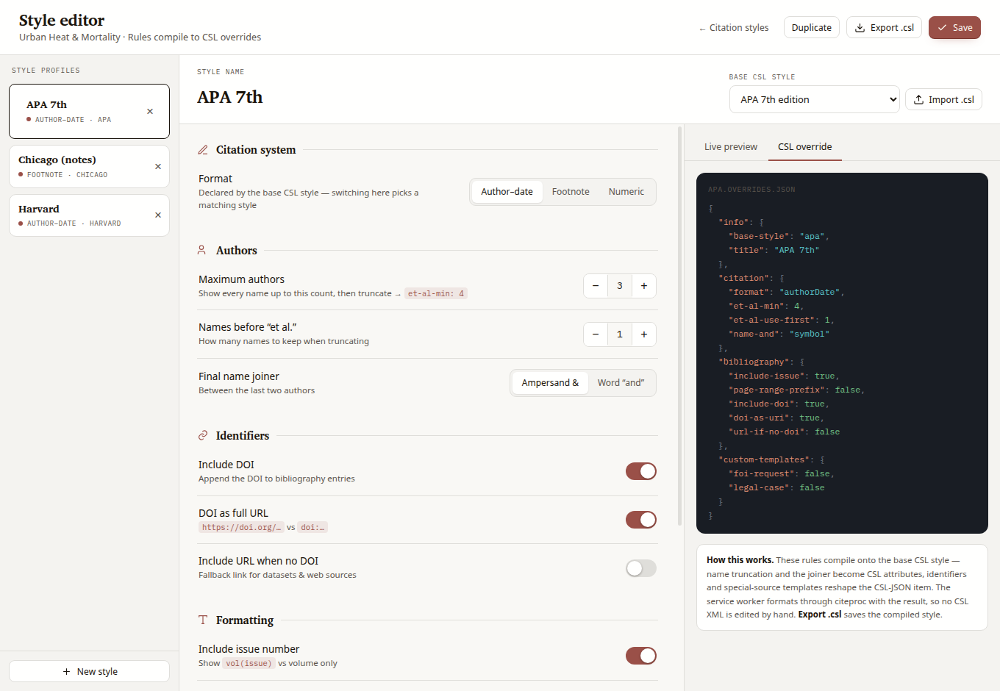

### Team

**Activity** — every change, recorded where it happens, with before→after diffs:

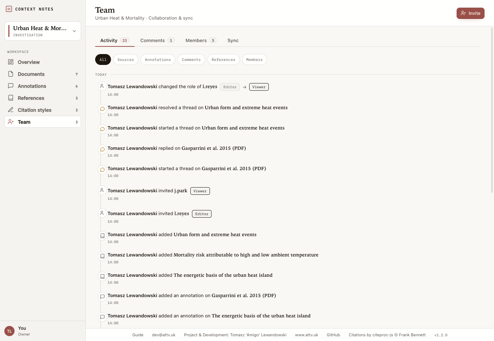

**Comments** — threads anchored to a note or a source, with reply and resolve:

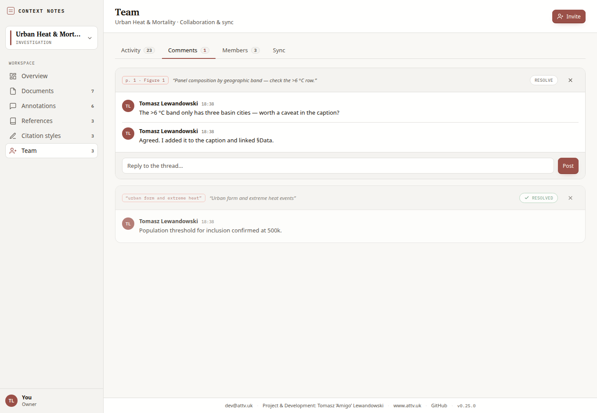

**Members** — roles, the capability matrix, and the plain statement that roles are advisory:

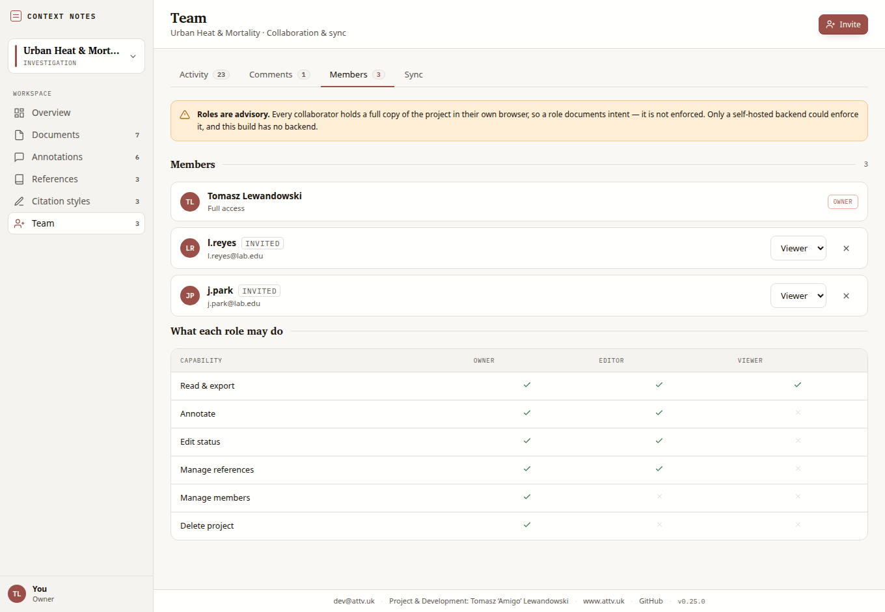

**Sync** — the mode selector, snapshot export with an optional password, and import:

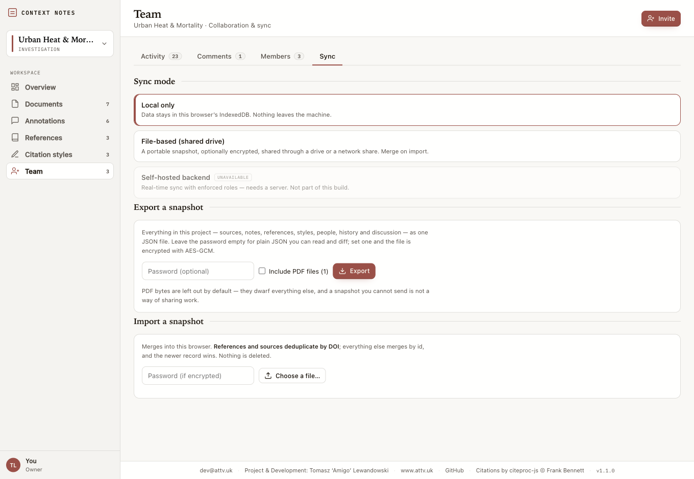

### Side panel

Picking a status directly — including moving a source _back_, which click-cycling could never do:

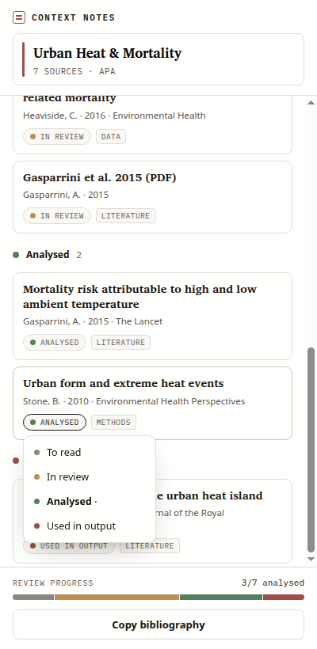

</details>

## Development

```bash
npm install        # install dependencies
npm run dev        # Vite dev server with MV3 HMR (load dist/ as an unpacked extension)
npm run build      # typecheck + production build → dist/
npm test           # unit tests (Vitest)
npm run test:e2e   # end-to-end tests (Playwright, extension loaded in headed Chromium)
npm run lint       # ESLint
npm run typecheck  # tsc --noEmit
npm run format     # Prettier (CI runs format:check, which only verifies)
npm run package    # build + zip dist/ → release/context-notes-v<version>.zip, then validate it
npm run store:assets  # regenerate the Web Store images in doc/store/ (run under xvfb)
npm run pages      # regenerate docs/ — the published site and privacy policy
```

Load the unpacked extension from `dist/` at `chrome://extensions` (Developer mode).

To publish: `npm run package` builds the zip **and checks it against what the Web Store enforces at
upload**, then upload it with the copy in [`doc/STORE-LISTING.md`](doc/STORE-LISTING.md) and the
images in [`doc/store/`](doc/store/). The steps are in
[`doc/DISTRIBUTION.md`](doc/DISTRIBUTION.md); the listing's privacy policy is published at
<https://amigouk.github.io/Research-Chrome-Extension/privacy.html> and generated from
[`doc/PRIVACY.md`](doc/PRIVACY.md).

## Architecture

- **Ports & adapters:** a pure domain core in `src/core` (no `chrome.*`, no storage types) with thin
  adapters in `src/adapters`. Surfaces: `src/background` (service worker), `src/sidepanel`,
  `src/options` (dashboard), `src/pdfviewer`.
- **Storage:** IndexedDB with a versioned schema and append-only migrations (currently **v5**:
  projects, documents, annotations, references, citation styles, users, files, activity, comment
  threads, imported base styles).
- **Snapshots:** `src/core/snapshot/envelope.ts` (WebCrypto AES-GCM + PBKDF2, 600k iterations),
  `src/core/snapshot/validate.ts` (the import boundary — an imported file is somebody else's data)
  and `src/core/usecases/snapshot.ts` (build / merge, hard DOI dedup, newest record wins).
- **Messaging:** one typed contract (`src/core/messages.ts`) shared by every surface, routed by a
  pure `handleRequest`. Domain changes are recorded to the activity feed **there**, so a change made
  in the side panel or the PDF reader shows up without either surface knowing the feed exists.
- **Citations:** citeproc-js + CSL, vendored locally — MV3 forbids remote code. The base styles are
  fetched as extension assets on first use rather than bundled, keeping ~520 kB of XML out of the
  service worker.

See [`doc/architecture.md`](doc/architecture.md), [`doc/data-model.md`](doc/data-model.md) and
[`doc/citations.md`](doc/citations.md).

## Documentation

| File                                               | Contents                                            |
| -------------------------------------------------- | --------------------------------------------------- |
| [`doc/STATUS.md`](doc/STATUS.md)                   | Where the project stands and what to do next        |
| [`doc/roadmap.md`](doc/roadmap.md)                 | The five development phases                         |
| [`doc/architecture.md`](doc/architecture.md)       | Ports & adapters, testability                       |
| [`doc/data-model.md`](doc/data-model.md)           | Entities and anchoring                              |
| [`doc/citations.md`](doc/citations.md)             | CSL, styles and user rules                          |
| [`doc/ui-ux.md`](doc/ui-ux.md)                     | Surfaces and interaction design                     |
| [`doc/DISTRIBUTION.md`](doc/DISTRIBUTION.md)       | Packaging and publishing to the Chrome Web Store    |
| [`doc/STORE-LISTING.md`](doc/STORE-LISTING.md)     | The listing copy, ready to paste into the dashboard |
| [`doc/PRIVACY.md`](doc/PRIVACY.md)                 | The privacy policy (source of the published page)   |
| [`CHANGELOG.md`](CHANGELOG.md)                     | Every release, Keep a Changelog format              |
| [`THIRD-PARTY-NOTICES.md`](THIRD-PARTY-NOTICES.md) | Bundled fonts, CSL styles and their licences        |

## Testing

465 unit tests (Vitest, `fake-indexeddb`) and 54 end-to-end tests that load the built extension into
a real Chromium and drive the side panel, dashboard and PDF reader. CI runs typecheck → lint →
format:check → unit → build, plus an E2E job under xvfb.

---

dev@attv.uk · Project & Development: Tomasz 'Amigo' Lewandowski · [www.attv.uk](https://www.attv.uk)
